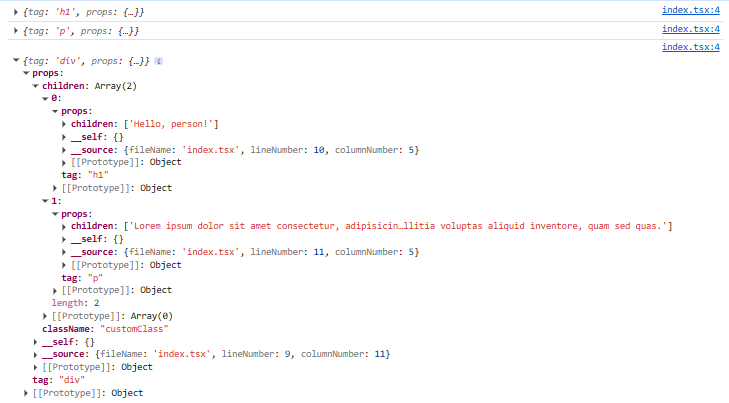

# Create real React project:

**npm add -D @types/react @types/react-dom**

npm run dev

# Create your own React project:

**npm add typescript parcel -D** installs TypeScript and Parcel as dev-only tools used to build and bundle your project, not as runtime dependencies. Parcel is a zero-config web bundler that turns your source files into browser-ready assets

add script and run **npm run ts:init** to create your tsconfig file. tsconfig.json tells TypeScript how to understand, type-check, and compile your code.

**npm run dev** to run project

## Create our first react object:

JSX is a syntax extension that must be transformed into standard JavaScript code before the browser can execute it. And because tsconfig.json is configured with "jsx": "react", the TypeScript compiler transforms each JSX element into a call to `React.createElement`. So, we are creating our own `React.createElement`.

```tsx
let React = {
    createElement: (...args) => {
        console.log(args);
    },
}

const a = <div>hello</div>;
```


```tsx
let React = {
    createElement: (...args) => {
        console.log(args);
    },
}

const a = <div className="customClass">
    <h1>Hello, person!</h1>
    <p>
        Lorem ipsum dolor sit amet consectetur, adipisicing elit. Recusandae nemo tempore sint nihil, cumque incidunt. Aspernatur eaque molestiae praesentium dolorem officiis officia expedita mollitia voluptas aliquid inventore, quam sed quas.
    </p>
</div>;
```


## Creating Virtual DOM:

```tsx
let React = {
    createElement: (tag, props, ...children) => {
        var element = { tag, props : { ...props, children}}
        console.log(element);
        return element;
    },
}

const a = <div className="customClass">
    <h1>Hello, person!</h1>
    <p>
        Lorem ipsum dolor sit amet consectetur, adipisicing elit. Recusandae nemo tempore sint nihil, cumque incidunt. Aspernatur eaque molestiae praesentium dolorem officiis officia expedita mollitia voluptas aliquid inventore, quam sed quas.
    </p>
</div>;
```



## What source files are built on the browser: 

```html
<!DOCTYPE html><html lang="en"><head>
    <meta charset="UTF-8">
    <title>Your own React</title>
  </head>
  <body>
    <div id="root"></div>
    <script type="module" src="/yourreact.2ef0291c.js"></script>  
</body></html>
```


```js
...
},{}],"lzhIH":[function(require,module,exports,__globalThis) {
let React = {
    createElement: (tag, props, ...children)=>{
        if (typeof tag == "function") return tag(props);
        var element = {
            tag,
            props: {
                ...props,
                children
            }
        };
        console.log(element);
        return element;
    }
};
const App = ()=>/*#__PURE__*/ React.createElement("div", {
        className: "customClass",
        __source: {
            fileName: "index.tsx",
            lineNumber: 13,
            columnNumber: 19
        },
        __self: this
    }, /*#__PURE__*/ React.createElement("h1", {
        __source: {
            fileName: "index.tsx",
            lineNumber: 14,
            columnNumber: 5
        },
        __self: this
    }, "Hello, person!"), /*#__PURE__*/ React.createElement("p", {
        __source: {
            fileName: "index.tsx",
            lineNumber: 15,
            columnNumber: 5
        },
        __self: this
    }, "Lorem ipsum dolor sit amet consectetur, adipisicing elit. Recusandae nemo tempore sint nihil, cumque incidunt. Aspernatur eaque molestiae praesentium dolorem officiis officia expedita mollitia voluptas aliquid inventore, quam sed quas."));
/*#__PURE__*/ React.createElement(App, {
    __source: {
        fileName: "index.tsx",
        lineNumber: 20,
        columnNumber: 1
    },
    __self: this
});

},{}]},["lKml7","lzhIH"], "lzhIH", "parcelRequire94c2", {})
//# sourceMappingURL=yourreact.2ef0291c.js.map
```

## useState hook:

# References:

[Deconstructing React – Tejas Kumar](https://www.youtube.com/watch?v=eTcyOCd6v1c)
[react-source-code-walkthrough](https://jser.dev/series/react-source-code-walkthrough/)