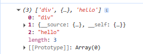
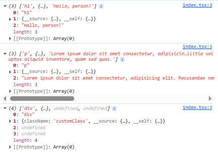

# Create real React project:

**npm add -D @types/react @types/react-dom**

npm run dev

# Create your own React project:

**npm add typescript parcel -D** installs TypeScript and Parcel as dev-only tools used to build and bundle your project, not as runtime dependencies. Parcel is a zero-config web bundler that turns your source files into browser-ready assets

add script and run **npm run ts:init** to create your tsconfig file. tsconfig.json tells TypeScript how to understand, type-check, and compile your code.

**npm run dev** to run project

## Create our first react object:

JSX is a syntax extension that must be transformed into standard JavaScript code before the browser can execute it. And because tsconfig.json is configured with "jsx": "react", the TypeScript compiler transforms each JSX element into a call to `React.createElement`. So, we are creating our own `React.createElement`.

```tsx
let React = {
    createElement: (...args) => {
        console.log(args);
    },
}

const a = <div>hello</div>;
```



```tsx
let React = {
    createElement: (...args) => {
        console.log(args);
    },
}

const a = <div className="customClass">
    <h1>Hello, person!</h1>
    <p>
        Lorem ipsum dolor sit amet consectetur, adipisicing elit. Recusandae nemo tempore sint nihil, cumque incidunt. Aspernatur eaque molestiae praesentium dolorem officiis officia expedita mollitia voluptas aliquid inventore, quam sed quas.
    </p>
</div>;
```



## React concepts

- Create Virtual DOM:


- useState hook:

# References:

[
Deconstructing React – Tejas Kumar](https://www.youtube.com/watch?v=eTcyOCd6v1c)